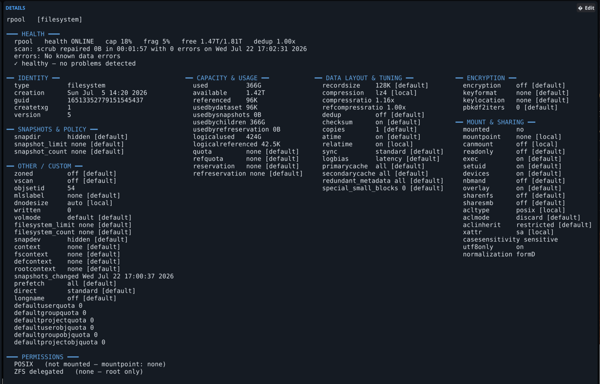

<div align="center">

&nbsp;&nbsp;

# zxplore

**A direct interface to your ZFS primitives — not a dashboard.**

*Your data, at every point in time, on any machine you choose — with a keypress.*

[](LICENSE)
[](https://github.com/zxplore/zxplore/actions/workflows/ci.yml)


</div>

`zxplore` is a fast, keyboard-driven console for the ZFS you already run.
Three tabs — **Browser** (F1), **Transfer** (F2), **Explorer** (F3) — over one
engine: browse datasets with a full properties + permissions dossier, snapshot
on tap, **restore any file from any snapshot**, diff two points in time, and
point-and-shoot replicate to any pool or host over SSH — one tool, on **any
OpenZFS system**.

It's a **primitives** tool, not a management UI: every action maps to a plain
`zfs`/`zpool` command. Nothing hidden, nothing invented — destructive actions
show the literal command before they run, and every executed mutation lands in
an audit log.

<div align="center">

<br/><sub>The dossier up close: health first, every property with its source, one <b>Edit</b> away from being changed.</sub>
</div>

---

## Things that used to be terminal archaeology

ZFS has had these superpowers for twenty years. What it never had was a
surface where they take **one gesture**. Every example below is a real flow in
zxplore — and under each one is the exact command it runs, because that's the
contract: you could always have typed it yourself.

**Rescue Tuesday's config file.**
`F3` → pick the pool → pick the dataset → walk to the file → every snapshot
that holds it appears, sizes and mtimes flagged `Δ DIFF`/`≡ same` → Enter →
*Restore as copy*. Deleted files included — if any snapshot still has it, you'll
find it.
```
# cp -a /tank/data/.zfs/snapshot/daily-2026-07-22/etc/pf.conf /tank/data/etc/pf.conf.from-daily-2026-07-22
```

**Grow a volume like it's a spreadsheet cell.**
Select the zvol backing your VM, `✎ Edit`, type the new size, Enter. The LUN
is bigger, live, while the VM runs. Capping a runaway dataset is the same
gesture on `quota`; guaranteeing space for one is `reservation`.
```
# zfs set volsize=40G tank/vm/db0
# zfs set quota=50G tank/home/downloads
```

**Send an encrypted dataset offsite that the offsite box can't read.**
`F2`, connect the right pane to your backup host, *Replicate left → right*.
zxplore picks the cheapest correct stream by itself — resume token if a prior
run was interrupted, incremental if the ends share a snapshot (or a bookmark
if you pruned it), full send otherwise — and an encrypted source goes **raw**:
blocks travel still-encrypted, the key never leaves home.
```
# zfs send -v -w -i 'tank/vault@sun' 'tank/vault@mon' | ssh backup1 'zfs recv -s -F -o readonly=on -o canmount=noauto backups/vault'
```

**Ask "what changed since Friday?" and get an answer.**
Right-click a dataset → *diff* → pick Friday's snapshot. Modified, added,
removed, renamed — colored, filterable by path.
```
$ zfs diff -H tank/projects@friday
```

**Take a restore point before an upgrade, roll back when it goes sideways.**
*Boot Environments* → create. The BE dataset is **derived from the pool's
`bootfs`** — never a hardcoded name — so it works on your layout, whatever
distro installed it.
```
# zfs snapshot rpool/ROOT/fedora@pre-upgrade
# zfs rollback -r rpool/ROOT/fedora@pre-upgrade   # if it goes sideways
```

**Unlock an encrypted dataset without the passphrase ever touching a
command line.** Right-click → *Unlock* — the passphrase travels on stdin,
invisible to `ps`, absent from every log including zxplore's own audit log.

**Drive a machine on the other side of the planet like it's local.**
A saved server is a name, a host, and a key. The far side needs **nothing but
OpenZFS and sshd** — no agent, no daemon, no install. Browse it, snapshot it,
replicate *between two remote machines* from your laptop.

## The Explorer: your files, across time

<div align="center">

</div>

On most systems you *back up* your data. With ZFS, the filesystem already
**is** every version of itself — the `F3` Explorer makes that tangible:

- Pick a **zpool**, see its datasets with mount state, and descend into any
  mounted one (pool roots are often `mountpoint=none` — the Explorer shows you
  where the files actually live instead of a blank pane).
- Browse the live tree, or transparently **inside any snapshot**
  (`.zfs/snapshot`), walking yesterday's filesystem like it's still there.
- Pick any file and see it across **every snapshot that contains it**, then
  restore any version — over live (typed confirmation) or alongside as
  `name.from-SNAPSHOT`.

## A real console, end to end

| | |
|---|---|
|  | **Snapshots as first-class objects.** Roll back (told exactly what gets destroyed), clone, browse its files, diff against live, hold, bookmark, destroy. |
|  | **Any ZFS box, from here.** Saved servers, key-first: a password authorizes your key *once* — over a host-key-pinned connection — then it's never stored. |
|  | **Boot environments** — derived from the pool's `bootfs`, never a hardcoded name: create restore points, roll back, delete. |
|  | **Pools** — scrub, trim, clear, import. Drill down for vdev topology with error counters, iostat, the file layout, and the two truths of free space: `zfs list` next to `df`. |

Plus the daily drivers: every property with its source, both permission
layers (POSIX/ACL + `zfs allow`), an inline property editor, native
encryption, full dataset lifecycle — and helpful guidance, never a blank
window, on a host with no pools or no ZFS at all. The built-in manual (`?`)
renders the man page in-app, even where `man` was never installed.

<div align="center">
 
<br/><sub>Instant splash · light theme included.</sub>
</div>

## Install

**Linux**

```
git clone https://github.com/zxplore/zxplore
cd zxplore
make               # builds ./zxplore (GUI+TUI) and ./zxplore-tui (static)
sudo make install  # binaries + man page + icons + launchers
```

**FreeBSD** — OpenZFS is in base; use `gmake` (the Makefile is GNU make):

```
pkg install -y go gmake pkgconf mesa-libs libX11 libxkbcommon wayland fontconfig
git clone https://github.com/zxplore/zxplore
cd zxplore
gmake && gmake install         # as root; installs to /usr/local
```

Terminal-only FreeBSD box? `pkg install -y go gmake` is enough —
`gmake zxplore-tui` builds the static TUI with no graphics deps at all.
(GUI privileged actions use `pkexec` — `pkg install polkit`; the TUI elevates
via `sudo`/root.)

Two binaries come out of one tree — both get a desktop launcher:

| binary | what | needs |
|---|---|---|
| `zxplore` | native GUI (Fyne) + `--tui` | cgo, OpenGL, X11/Wayland |
| `zxplore-tui` | terminal-only, **fully static** | nothing — `scp` it anywhere |

Headless box? `make zxplore-tui` needs only the Go toolchain — no GL, no dev
headers. Or install straight from source:

```
go install github.com/zxplore/zxplore@latest     # static TUI build
```

<details>
<summary><b>GUI build dependencies per distro</b></summary>

```
# Fedora / RHEL / Rocky
sudo dnf install -y golang gcc pkgconf-pkg-config mesa-libGL-devel \
  libX11-devel libXcursor-devel libXrandr-devel libXinerama-devel \
  libXi-devel libXxf86vm-devel wayland-devel libxkbcommon-devel fontconfig-devel

# Debian / Ubuntu
sudo apt-get install -y golang gcc pkg-config libgl1-mesa-dev xorg-dev \
  libwayland-dev libxkbcommon-dev libfontconfig1-dev

# Arch
sudo pacman -S --needed go gcc pkgconf libgl libxcursor libxrandr \
  libxinerama libxi wayland libxkbcommon fontconfig

# FreeBSD (build with gmake, not make)
pkg install -y go gmake pkgconf mesa-libs libX11 libxkbcommon wayland fontconfig
```
</details>

Runtime: `zfs`/`zpool` (and for the GUI, `libGL` + an X11/Wayland session).

## Usage

```
zxplore            # the native GUI console
zxplore --tui      # terminal UI from the full binary
zxplore-tui        # the static terminal binary (same UI)
man zxplore        # full documentation (also built in: press ?)
```

The TUI is a full console, not a fallback — browser, transfer, the snapshot
file explorer, and pool drill-downs, with a `:` command bar, `/` filter,
vim keys, and a `?` key overlay. It is **read-only by default**: mutations
need `:rw` first, and destroys demand retyping the target's name.

**Keys:** `F1`/`F2`/`F3` switch Browser / Transfer / Explorer · `?` opens the
manual · `Tab` hop between panes · `↑↓` `PgUp`/`PgDn` `Home`/`End` move ·
`Ctrl+F` (or `/`) find · **right-click a dataset** for the full lifecycle
menu · `Enter` or click a snapshot for actions · `Esc` dismiss · `Alt+Q` quit.

## Security model

- **Read-only by default, in both UIs** — the TUI unlocks with `:rw`, the GUI
  with the toolbar lock (red while armed); destroys, rollbacks, and
  restore-over-live always demand retyping the target's name.
- Runs **unprivileged, tries unprivileged first** — root and
  [`zfs allow`-delegated](https://openzfs.github.io/openzfs-docs/man/master/8/zfs-allow.8.html)
  users never see a prompt; only a real permission failure retries via
  `pkexec` (with a polkit policy so one auth covers minutes, not one command).
- **Host keys are pinned** — SSH runs with `accept-new`: first contact records
  the key, a changed key is refused. That includes the one-time password dial
  that installs your key.
- **Key-first SSH, pure Go.** A password is used at most once — to authorize a
  key over an in-process SSH dial (no `sshpass`, nothing on any argv) — and
  never stored. `~/.config/zxplore/servers.json` holds key *paths* only.
- **Passphrases on stdin** — encryption keys never appear in `ps` or logs.
- **Audit log** — every executed mutating command is appended to
  `~/.local/state/zxplore/audit.log` (timestamp, host, exact argv).
- **Dry-run honesty** — restore/diff/replicate dialogs show the literal
  command before you confirm it.

## Testing

`make test` runs the full suite for both build flavors. Engine tests execute
against a **mock CLI** — fake `zfs`/`zpool`/`pkexec`/`ssh` planted on `PATH`,
serving canned fixtures and logging every invocation — so each feature is
proven end to end (exact argv out, parsing back in) without ever touching a
real pool. The feature→proof matrix lives in
[`docs/TESTING.md`](docs/TESTING.md).

## Portability

The core is pure `zfs`/`zpool` + POSIX shell and runs anywhere OpenZFS does —
Linux and FreeBSD, local or over SSH. The remote end needs nothing but ZFS
itself: file listing is POSIX `ls`, restores are `cp -a`, replication is
`zfs send | zfs recv`. The static `zxplore-tui` binary has zero runtime
dependencies — and even cross-compiles for illumos
(`GOOS=illumos go build`; builds clean, reports from real hardware welcome).
The header tells you what it detected: `OpenZFS 2.4.3 · Fedora Linux 44`,
falling back gracefully on stacks without `zfs version`.

## Documentation

- [`man zxplore`](docs/zxplore.1) — the manual: views, keys, privileges, files.
- [`docs/DESIGN.md`](docs/DESIGN.md) — why it's built the way it is.
- [`docs/TESTING.md`](docs/TESTING.md) — what's proven, and how.

## License

BSD 3-Clause. See [LICENSE](LICENSE).
