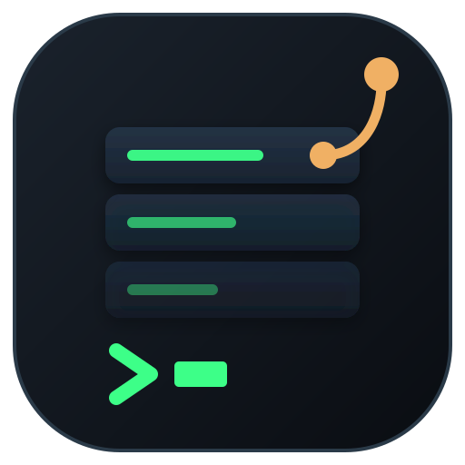
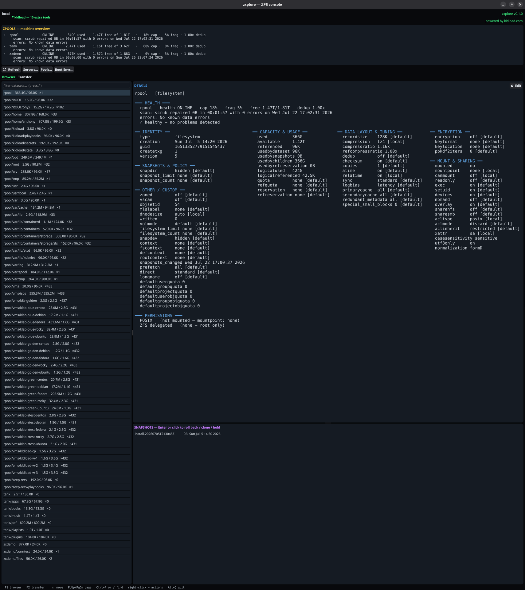
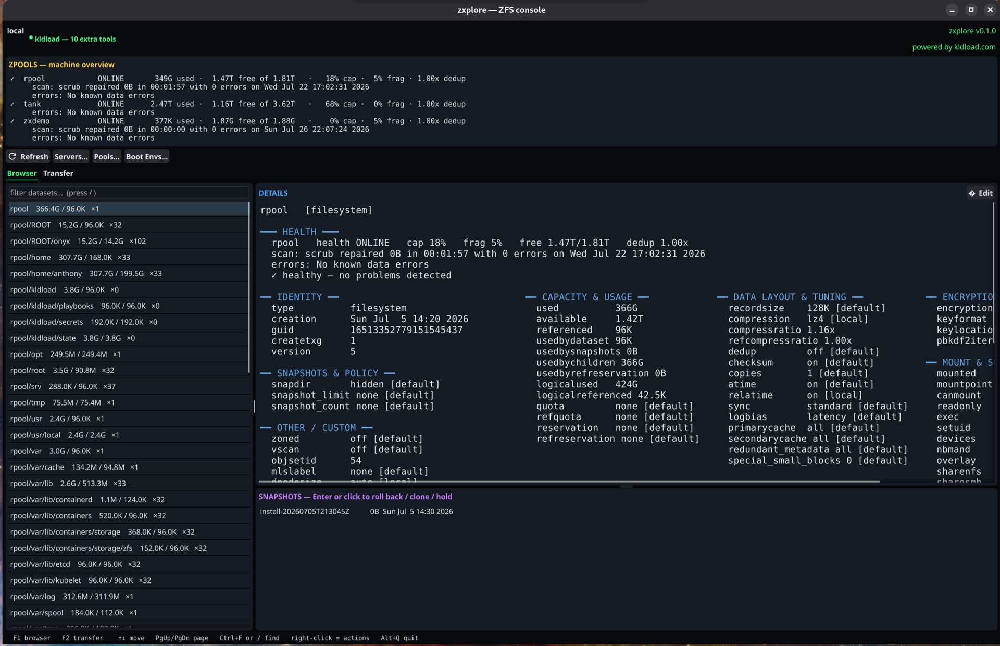
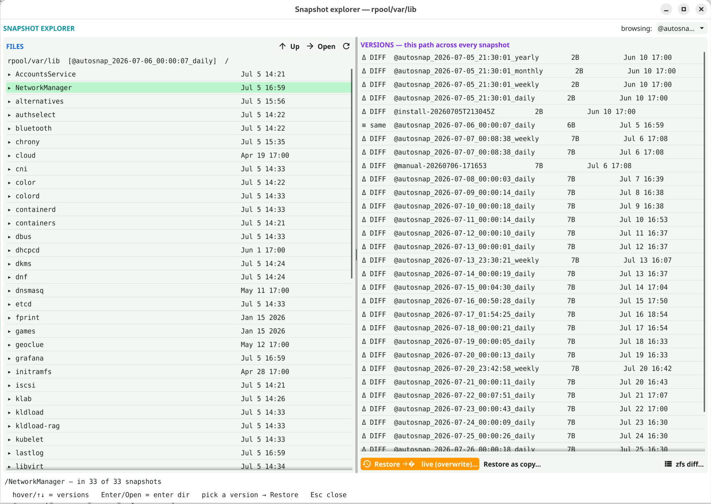
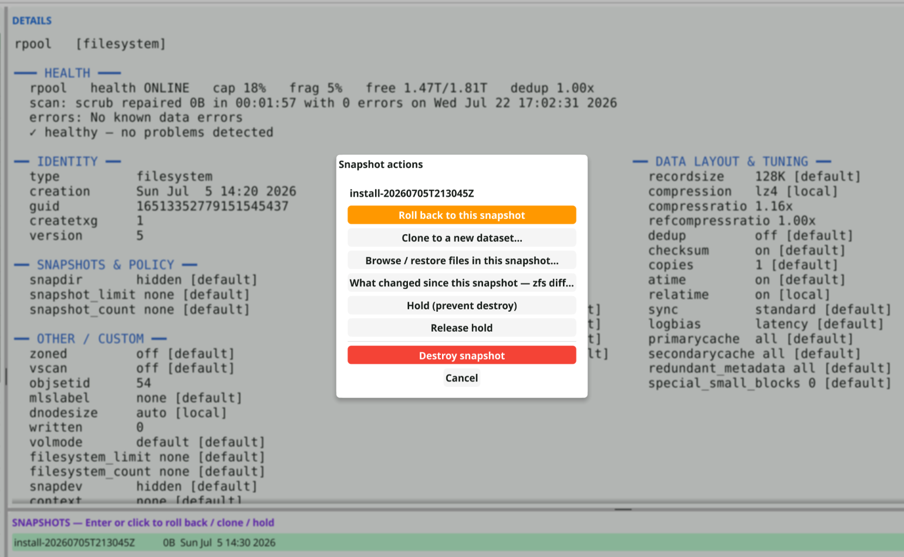
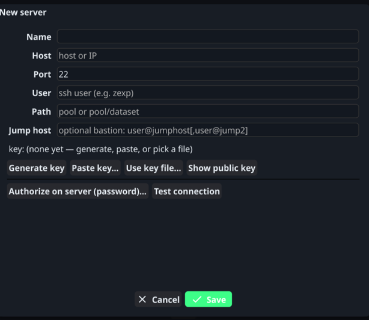
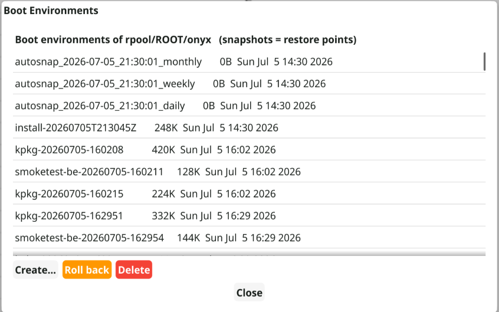
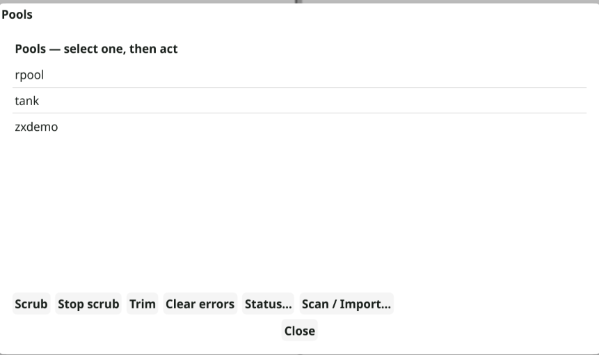
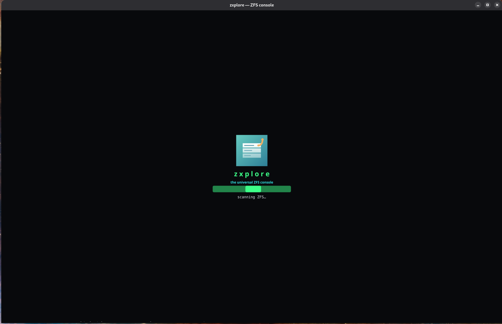
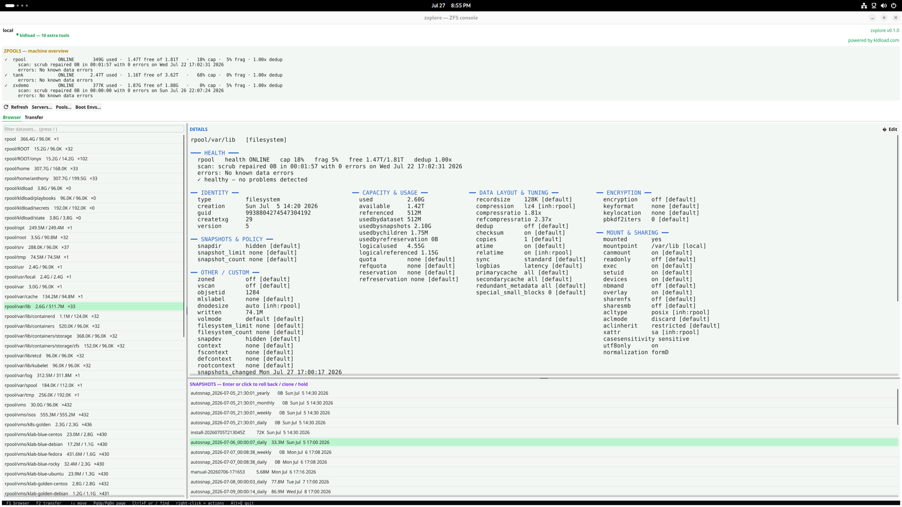

<div align="center">

&nbsp;&nbsp;

# zxplore

**A direct interface to your ZFS primitives — not a dashboard.**

*Your data, at every point in time, on any machine you choose — with a keypress.*

[](LICENSE)




</div>

`zxplore` is a fast, keyboard-driven console for the ZFS you already run.
Browse datasets with a full properties + permissions dossier, snapshot on tap,
**restore any file from any snapshot**, diff two points in time, and
point-and-shoot replicate to any pool or host over SSH — one tool, on **any
OpenZFS system**.

It's a **primitives** tool, not a management UI: every action maps to a plain
`zfs`/`zpool` command. Nothing hidden, nothing invented — destructive actions
show the literal command before they run, and every executed mutation lands in
an audit log.

<div align="center">

<br/><sub>Dark or light — it follows your desktop. Every property, with its source, one <b>Edit</b> away from being changed.</sub>
</div>

---

## The killer feature: your files, across time

<div align="center">

</div>

On most systems you *back up* your data. With ZFS, the filesystem already
**is** every version of itself — the snapshot explorer makes that tangible:

- Browse the files of a dataset — live, or transparently **inside any
  snapshot** (`.zfs/snapshot`), walking yesterday's tree like it's still there.
- Pick any file and see it across **every snapshot that contains it**, with
  size/mtime deltas flagged (`Δ DIFF` / `≡ same`). Deleted files included —
  if any snapshot still holds it, you'll find it.
- **Restore any version** into the live dataset — overwrite in place, or
  alongside as `name.from-SNAPSHOT`. No `cp` gymnastics; the exact command is
  shown before you confirm.
- **`zfs diff` as a pane** — what changed between two snapshots (or a snapshot
  and live), colored by change type, filterable by path.

## A real console, end to end

| | |
|---|---|
|  | **Snapshots as first-class objects.** Enter or click any snapshot: roll back (with an explicit warning about exactly what gets destroyed), clone to a new dataset, browse its files, diff it against live, hold/release, destroy. |
|  | **Any ZFS box, from here.** WinSCP-style saved servers with key-first auth — generate, paste, or point at a key, then authorize it with a password used *once* and never stored. Jump hosts, custom ports. Replication runs local↔remote or even remote↔remote, incremental when a common snapshot exists. |
|  | **Boot environments** — derived from the pool's `bootfs`, never a hardcoded name: create restore points, roll back, delete. |
|  | **Pools** — health pinned at the top of every view; scrub, trim, clear errors, **Scan / Import** for exported pools (moved disks, rescue boots), and a **drill-down dossier**: vdev topology with per-device error counters, one-shot iostat, the pool's file layout, and the two truths of free space — `zfs list` next to `df`, which famously disagree by design. |

Plus the daily-driver details: a dossier with **every** property and its
source (`local` / `inherited from …` / `default`), both permission layers
(POSIX/ACL **and** `zfs allow`), an inline property editor, native encryption
(unlock / lock / change-key / create — passphrases on stdin, never argv),
dataset lifecycle (create / rename / mount / zvol / destroy), light **and**
dark theme, and a guidance screen — not a blank window — on a host with no
pools, or no ZFS at all.

<div align="center">
 
<br/><sub>Instant splash while the first scan runs · and a light theme, if your desktop swings that way.</sub>
</div>

## Install

**Linux**

```
git clone https://github.com/zxplore/zxplore
cd zxplore
make               # builds ./zxplore (GUI+TUI) and ./zxplore-tui (static)
sudo make install  # binaries + man page + icons + launchers
```

**FreeBSD** — OpenZFS is in base; use `gmake` (the Makefile is GNU make):

```
pkg install -y go gmake pkgconf mesa-libs libX11 libxkbcommon wayland fontconfig
git clone https://github.com/zxplore/zxplore
cd zxplore
gmake && gmake install         # as root; installs to /usr/local
```

Terminal-only FreeBSD box? `pkg install -y go gmake` is enough —
`gmake zxplore-tui` builds the static TUI with no graphics deps at all.
(GUI privileged actions use `pkexec` — `pkg install polkit`; the TUI elevates
via `sudo`/root.)

Two binaries come out of one tree — both get a desktop launcher:

| binary | what | needs |
|---|---|---|
| `zxplore` | native GUI (Fyne) + `--tui` | cgo, OpenGL, X11/Wayland |
| `zxplore-tui` | terminal-only, **fully static** | nothing — `scp` it anywhere |

Headless box? `make zxplore-tui` needs only the Go toolchain — no GL, no dev
headers. Or install straight from source:

```
go install github.com/zxplore/zxplore@latest     # static TUI build
```

<details>
<summary><b>GUI build dependencies per distro</b></summary>

```
# Fedora / RHEL / Rocky
sudo dnf install -y golang gcc pkgconf-pkg-config mesa-libGL-devel \
  libX11-devel libXcursor-devel libXrandr-devel libXinerama-devel \
  libXi-devel libXxf86vm-devel wayland-devel libxkbcommon-devel fontconfig-devel

# Debian / Ubuntu
sudo apt-get install -y golang gcc pkg-config libgl1-mesa-dev xorg-dev \
  libwayland-dev libxkbcommon-dev libfontconfig1-dev

# Arch
sudo pacman -S --needed go gcc pkgconf libgl libxcursor libxrandr \
  libxinerama libxi wayland libxkbcommon fontconfig

# FreeBSD (build with gmake, not make)
pkg install -y go gmake pkgconf mesa-libs libX11 libxkbcommon wayland fontconfig
```
</details>

Runtime: `zfs`/`zpool` (and for the GUI, `libGL` + an X11/Wayland session).

## Usage

```
zxplore            # the native GUI console
zxplore --tui      # terminal UI from the full binary
zxplore-tui        # the static terminal binary (same UI)
man zxplore        # full documentation
```

**Keys:** `F1`/`F2` switch Browser/Transfer · `Tab` hop between panes · `↑↓`
`PgUp`/`PgDn` `Home`/`End` move · `Ctrl+F` (or `/`) find · **right-click a
dataset** for the full lifecycle menu · `Enter` or click a snapshot for
actions · `Esc` dismiss · `Alt+Q` quit.

## Security model

- Runs **unprivileged**; elevates per command — `pkexec` locally, the connected
  (ideally [delegated](https://openzfs.github.io/openzfs-docs/man/master/8/zfs-allow.8.html))
  user remotely. `zfs allow send,snapshot,hold,diff,mount user pool/ds` is all
  a remote needs for the read/replicate paths.
- **Key-first SSH.** A password is used at most once (to authorize a key) and
  never stored. `~/.config/zxplore/servers.json` holds key *paths* only.
- **Passphrases on stdin** — encryption keys never appear in `ps` or logs.
- **Audit log** — every executed mutating command is appended to
  `~/.local/state/zxplore/audit.log` (timestamp, host, exact argv).
- **Dry-run honesty** — restore/diff/replicate dialogs show the literal
  command before you confirm it.

## Portability

The core is pure `zfs`/`zpool` + POSIX shell and runs anywhere OpenZFS does —
Linux and FreeBSD, local or over SSH. The remote end needs nothing but ZFS
itself: file listing is POSIX `ls`, restores are `cp -a`, replication is
`zfs send | zfs recv`. The static `zxplore-tui` binary has zero runtime
dependencies.

## Documentation

- [`man zxplore`](docs/zxplore.1) — the manual: views, keys, privileges, files.
- [`docs/DESIGN.md`](docs/DESIGN.md) — why it's built the way it is.

## License

BSD 3-Clause. See [LICENSE](LICENSE).
